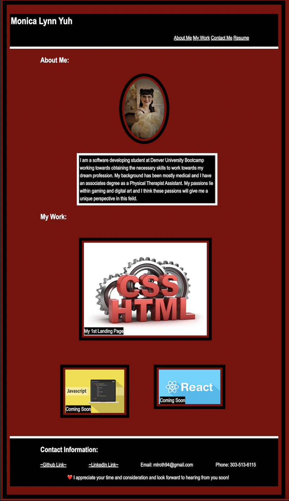
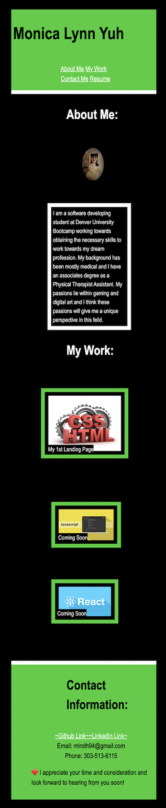

# Monica Lynn Yuh Portfolio
A showcase of my software engineering skills to date- intended to be updated as I continue to learn and grow within the program, and my new field.

## Table of Contents
    -Introduction
    -Technologies
    -Link to Deployed Application
    -Screenshot
### Introduction
A personal/professional webpage where you can find information about me, projects I have worked on, and ways to contact me.

It also has a link to my resume and professional profiles as well.
It is accessible on both full 1400px wide screen and a 480px wide screen as well.
### Technologies 
    -HTML
    -CSS
### Link to Deployed Application
https://moyuh.github.io/week-1-challenge/

### Screenshot of Webpage
Below is the 1400px screen

Below is the 480px screen

